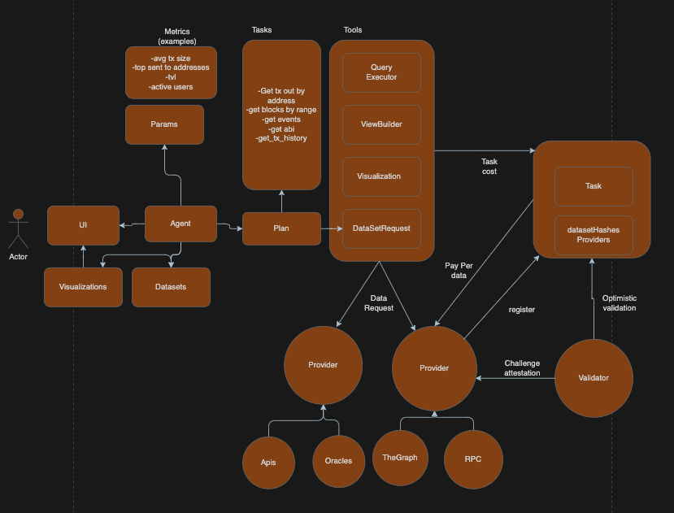

# Clear Blocks: Agentic On-Chain Analytics App 🚀

Clear Blocks is an innovative agentic application for on-chain analytics that leverages natural language processing to allow users to effortlessly query and analyze blockchain data. Whether you're interested in Sources of Funds (SOF) 💰, Usage of Funds (UOF) 📊, or Portfolio analytics 📈, Clear Blocks transforms your natural language queries into actionable insights.

## Key Features 🌟

- **Agentic Interaction**: Leverage natural language to interact with blockchain data. Simply ask questions, and the app understands your intent.
- **Multi-Chain Integration**: Initially integrates data from Base, Starknet, and Ethereum Mainnet, while remaining extensible to additional chains.
- **Decentralized Data Sourcing**: Participate in a decentralized ecosystem where multiple agents — run by anyone — can perform data sourcing tasks. Each agent contributes to a shared, common graph.
- **Rewards with Clear Blocks**: As agents resolve data sourcing tasks and enrich the common graph, they get rewarded, fostering an open and collaborative blockchain analytics community.
- **Extensible and Community-Driven**: Empower developers and data enthusiasts to add new agent modules, enhance functionalities, or integrate additional data sources.

## How It Works 🔍

1. **Natural Language Input:** The application starts by asking users what type of blockchain analysis they require. The system actually supports queries related to Sources of Funds (SOF), Usage of Funds (UOF), and Portfolio analysis.
2. **Intent & Parameter Extraction:** The app uses natural language processing to identify the user's request, extract relevant parameters (such as blockchain addresses, tokens, and networks), and guide the user to provide missing details.
3. **Analytics Execution:** Once all parameters are gathered, the corresponding analytics flow is executed. The app then returns the analysis results.
4. **Decentralized Data Sourcing with Agent Rewards:** Agents running on the network can contribute by performing data retrieval tasks, thereby adding to a collective common graph and earning rewards in the Clear Blocks ecosystem.

The agent works with many sources available to anyone, other agents can provide indexed data in exchange for rewards. During hackathon, the following sources were integrated, except for etherscan API which was avoided to use APIs, and get data as raw as possible allowing the agent to be more flexible and able to work in a more expressive manner, and as a proof of concept for independent agents as data providers.

## - The graph 📊

### All the ETH erc20 tokens transfers on ETH (at the time of presentation deadline only synced to 20% as it is huge) 🌐
https://thegraph.com/studio/subgraph/all-erc20-eth/

### All the ETH erc20 tokens transfers on Base, same only 9% synced as it is huge 📉
https://thegraph.com/studio/subgraph/baseallerc20transfers/

## - Juno Node for Starknet, but any standard JSON RPC node can be used 🔗

## - Etherscan API 🔍

### Diagram of the agent architecture

